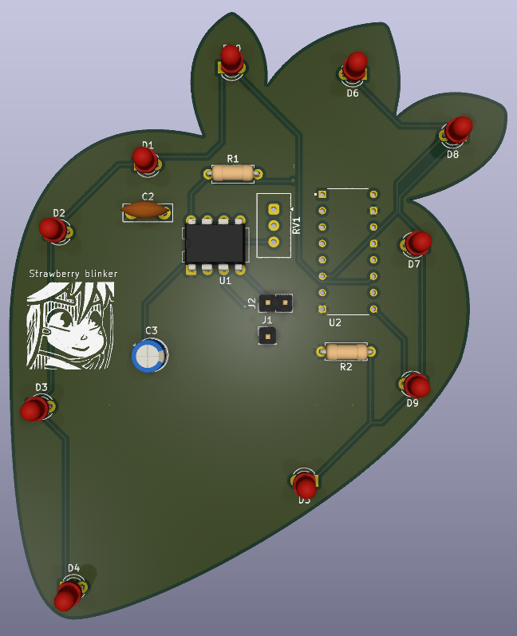

# Strawberry 555 Chaser

A strawberry themed 555 chaser blinky, that flashes 10 leds in a circle using a timer and counter circuit.

Made from [this hackclub tutorial](https://stasis.hackclub.com/starter-projects/blinky).

I made this project as an exercise to learn how to design pcbs using kicad. I learnt how to create schematics and design a pcb ready for manufacturing.

## Bill of Materials

| Item | Amount |
| - | - |
| pcb | 1 |
| led | 10 |
| NE555P | 1 |
| Conn 1x2 socket | 1 |
| Conn 1x1 socket | 1 |
| 1k ohm resistor | 1 |
| 470 ohm resistor | 1 |
| Potentiometer | 1 |
| Capacitor (0.01 uF) | 1 |
| Electrolytic capacitor (1 uF) | 1 |
| CD4017 | 1 |
